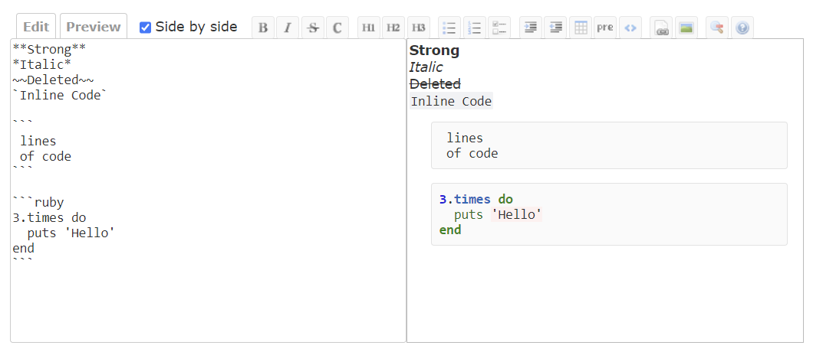

# Redmine Wiki Fullscreen Editor
This is a plugin for Redmine.  
This plugin adds full-screen feature to the wiki editor and adds a button to jsToolBar.  
Additionally, enabling side-by-side mode allows for instant preview.


## Compatibility

Only Redmine v5.1.1 has been tested.  
Other versions are untested.

## Installation
### When using git
1. Clone this repository to your Redmine plugins directory.
    ```
    git clone https://github.com/sk-ys/redmine_wiki_fullscreen_editor.git YOUR_REDMINE_DIRECTORY/plugins/redmine_wiki_fullscreen_editor
    ```
2. Restart Redmine.

### When not using git
1. Download zip file from the [release page](https://github.com/sk-ys/redmine_wiki_fullscreen_editor/releases) or the [latest main repository](https://github.com/sk-ys/redmine_wiki_fullscreen_editor/archive/refs/heads/main.zip). 
2. Extract the ZIP file to your Redmine plugin directory. The name of the unzipped directory must be `redmine_wiki_fullscreen_editor`.
3. Restart Redmine.

## Uninstallation
1. Remove this plugin directory from the plugins directory.
2. Restart Redmine.
